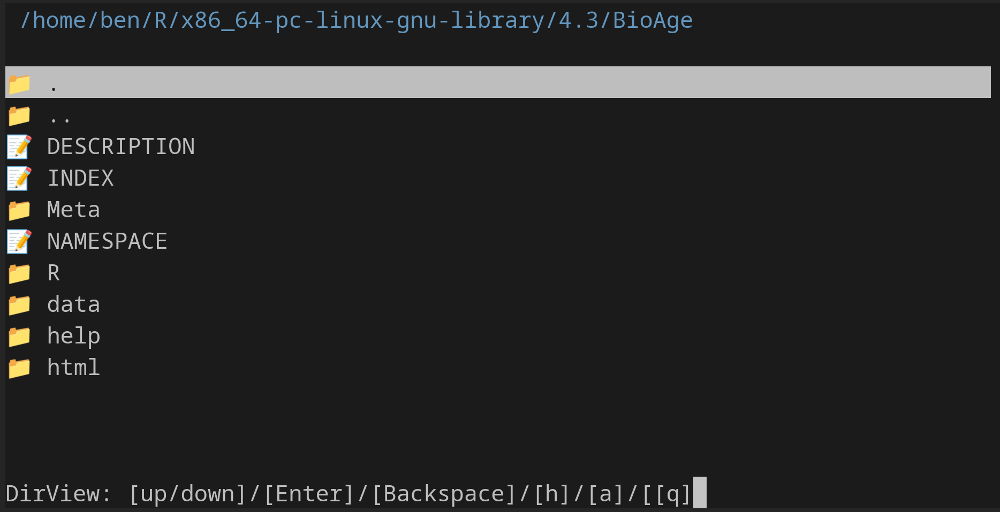

# DirView

## dirview
dirview - a minimal directory viewer written in C

## CONFIG
programs can be defined in config.in
```
first entry > your code editor (current: vim)
second entry > your image viewer (current: feh)
third entry > your pdf reader (current: okular)
```
## COMPILE
```
sudo apt update && sudo apt install libncursesw6
make
```

## HOWTO
move: Up and Down arrows

open/cd: Enter

back: Backspace

toggle hidden/dot files: h key

about: a key

quit: q key

---

---

## DEV
developed by msb

